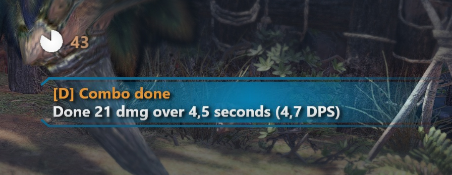

<!--<hide>-->
# HunterPie Combo Meter Plugin
<!--</hide>-->

This plugin adds slasher-like combo meter. Each hit will continue combo if fit within pre-defined timeout. When combo is finished, it is rated with notification.

It can be used for:
 - quick evaluation and comparison weapon and/or attack chain effectiveness
 - having extra challenge to maintain combo streak
 - competing with friends

Here is example of meter and summary notification:

After expedition summary is displayed:

<!--<hide>-->

## Installation

Use HunterPie's plugin manager to find and install "Combo Meter" plugin.

**OR**

1. Drag'n'drop icon below to into HunterPie window:

   

   > NOTE: if that's doesn't work, click on icon with right mouse button and select "Save Link As". Then dran'n'drop saved file into HunterPie window.

2. Restart application *(there will be notification that will prompt you to do so)*

<!--</hide>-->

## Configuration

You can configure how plugin is evaluating combos by changing combo grade thresholds and combo timeout. To do that, open `config.json` (with plugin or HunterPie disabled) in plugin directory and edit `ComboGrades` & `ComboTimeout` values respectively.

Combo grade is evaluated based on multiplier to average HP of monsters in current location. So if `AvgHpMultiplier` is 0.05 and in location there are 3 monsters with 5000, 10000, 5000 max HP then threshold will be `(5000+10000+5000)*0.05=100` damage.

`Header` can contain "{Target}" placeholder which will be replaced with resulting damage threshold for this grade.

<!--<hide>-->
## Build

Project is dependent on `HunterPie.Core.dll` and `HunterPie.UI.dll` binaries. They will be referenced from `..\HunterPie\HunterPie.Core.dll` and `..\HunterPie\HunterPie.UI.dll` directories. So in order to build plugin, you have to checkout HunterPie as sibling to ComboMeter repo.

You can run `ComboMeter.TestApp` to quickly test components design and behavior without running HunterPie itself.

<!--</hide>-->
